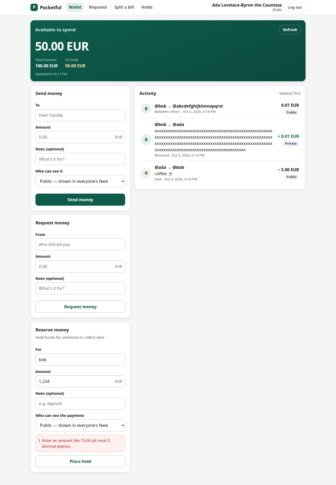
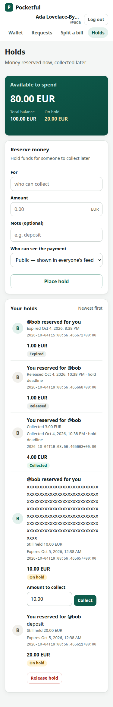

# pocketful — a four-seat dark factory

WeAreDevelopers × BAND "Dark Factory" hackathon · track **pocketful** · team **gheware**

Four Claude Code seats in one Band Desktop room — a **coordinator**, an **implementer**, a **modeler** that writes an
independent executable model of the spec without reading product code, and a **reviewer** that plants faults before it
accepts anything — built a wallet and payments service in four stages from **one human message**. Nobody wrote stage
code by hand; every seat commits under its own name.

| Stage | What | Dispatch → report | Defects caught before acceptance | Planted faults caught | Event harness, isolated, fresh clone |
|---|---|---|---|---|---|
| 1 | JSON API: idempotent writes, splits, atomic settlements, export/import | 51 min | 1 model ruling → product change | 6 / 6 | claimed stage 1 |
| 2 | Browser product, holds and partial captures, lost-response recovery | 1 h 44 min¹ | 2 minor UI notes → fixed in stage 3 | 9 / 9 | claimed stage 2 |
| 3 | Payment corrections, two time axes, statements, snapshots | 3 h 12 min¹ | 3 by the modeler, 2 reviewer REJECTs (incl. a capture/expiry race) | 11 / 11 | claimed stage 3 |
| 4 | Refunds, operator correction batches | 60 min | — | 10 / 10 | claimed stage 4 |

One dispatch 15:40 IST → `RUN COMPLETE` 00:27 IST: **8 h 46 min**, **$74.88** list-price equivalent.
¹ includes a Band message-delivery stall (two in total, ~90 min, disclosed in FACTORY.md).

## Read this repository

| Path | What |
|---|---|
| [`FACTORY.md`](FACTORY.md) | How the factory works, why, what it cost, what it caught, incidents, limits, how to stand it up |
| [`mandates/`](mandates/) | One generic mandate per seat: coordinator, implementer, modeler, reviewer |
| [`room.json`](room.json) | The full Band session download, unedited |
| [`dispatch/run2-pocketful.md`](dispatch/run2-pocketful.md) | The only human message of the run |
| `stage-N/` | A complete buildable service (Go, `Dockerfile`, `RUN.md`), `LEDGER.md`, the implementer's `tests/` |
| `stage-N/model/` | The modeler's reference model, differential driver and `RULINGS.md` |
| `stage-N/review/` | The reviewer's probes, fault-injection scripts, screenshots, `GAPS.md` and verdict |
| [`tools/`](tools/) | `seat_cost.py` (per-seat tokens and list price), `provenance.py` (commit → room message) |

## Evidence index

| Claim | Where | Reproduce |
|---|---|---|
| Each folder claims exactly its own stage | event harness | `python -m harness run --track pocketful --repo <clone> --all --mode isolated` |
| Gates 1, 2, 4 (seats, reciprocal @handles, generic mandates) | `mandates/`, `room.json` | `python -m harness check <clone> --track pocketful` |
| One human message | `room.json` | `python3 tools/provenance.py .` → "Human text messages: 1" |
| Every commit came from a seat in the room | Git + `room.json` | `git log --format=%an \| sort \| uniq -c`; table below |
| 36 / 36 planted faults caught | `stage-N/review/VERDICT.md`, `faults*.py` | rerun the reviewer's fault scripts per stage |
| What the shipped checks never asked | `stage-N/review/GAPS.md` | — |
| Second reading of the spec | `stage-N/model/RULINGS.md`, `driver.py` | `python3 stage-N/model/driver.py --base <url> --seeds 1-20` |
| Cost per seat | FACTORY.md | `python3 tools/seat_cost.py --repo <this repo> <seat transcript dirs>` |

## Who made each commit

Generated by `tools/provenance.py` from Git and `room.json`: each commit's author and the first room message that
cites it.

| Commit | Author (git) | First cited in room | By | Subject |
|---|---|---|---|---|
| `ae08eac` | Rajesh G | not cited | - | Mandates and placeholders (human-authored; no stage code) |
| `1c7ba0d` | implementer | 2026-10-04 10:12:10Z | implementer | stage-1: requirements ledger R1-R124 |
| `ab00565` | implementer | 2026-10-04 10:23:05Z | implementer | stage-1: service skeleton with all endpoints, Dockerfile, RUN.md |
| `f1c8b43` | implementer | 2026-10-04 10:23:05Z | implementer | stage-1: own tests; no 5xx on huge-exponent amounts; bounded malloc arenas |
| `579141c` | implementer | 2026-10-04 10:22:48Z | implementer | stage-1: ledger statuses, R125-R131, interpretation decisions |
| `0acbf75` | modeler | 2026-10-04 10:22:10Z | modeler | stage-1/model: reference model, rulings, differential driver |
| `5fd31a0` | modeler | 2026-10-04 10:41:39Z | modeler | stage-1/model: retire sessions invalidated by import; fixture generator index fi |
| `c2fd788` | implementer | 2026-10-04 10:43:53Z | implementer | stage-1: empty or non-object body is 400 malformed_request (ruling fd77ec53); ig |
| `2efff63` | implementer | 2026-10-04 10:46:07Z | implementer | stage-1: untrack compiled bytecode committed by mistake in f1c8b43 |
| `44fdfd6` | reviewer | 2026-10-04 11:00:44Z | reviewer | stage-1/review: probes, fault injection, gaps and verdict for 2efff63 (ACCEPT, 2 |
| `8b22637` | implementer | 2026-10-04 11:03:40Z | implementer | stage-2: copy of accepted stage-1 (2efff63) as starting point |
| `9e61b1c` | implementer | 2026-10-04 11:03:40Z | implementer | stage-2: requirements ledger (R1-R131 carried, R132-R218 new, M1/M2) |
| `81109d0` | implementer | 2026-10-04 11:30:28Z | implementer | stage-2: ledger R219-R226 from coordinator review |
| `8d69685` | implementer | 2026-10-04 11:08:19Z | implementer | stage-2: holds API (authorize/capture/void/expiry), available-based funds checks |
| `27cd98f` | implementer | 2026-10-04 11:08:24Z | implementer | stage-2: untrack modeler's stage-2/model files swept into 8d69685 by mistake (fi |
| `01a2a23` | implementer | 2026-10-04 11:30:28Z | implementer | stage-2: browser UI (wallet, pay/request/hold forms, feed, requests, split, hold |
| `a6a23a2` | implementer | 2026-10-04 11:30:28Z | implementer | stage-2: own browser tests; fix null placeholders and amount labels in UI; RUN.m |
| `2d979e7` | implementer | 2026-10-04 11:17:40Z | implementer | stage-2: ledger statuses, evidence map, interpretation decisions |
| `fc1cdda` | implementer | 2026-10-04 11:28:20Z | implementer | stage-2: accept seeded authorizations of amount 0 (consistent with seeded paymen |
| `7a4036f` | modeler | 2026-10-04 11:29:58Z | implementer | stage-2/model: holds, captures (final:false), void, clock expiry, upgrade runs,  |
| `bfeec97` | modeler | 2026-10-04 12:20:09Z | modeler | stage-2/model: README usage paths point at stage-2/model |
| `078b914` | reviewer | 2026-10-04 12:45:04Z | reviewer | stage-2/review: API/UI probes, fault injection, screenshots, gaps and verdict fo |
| `d349cfd` | implementer | 2026-10-04 12:46:24Z | implementer | stage-3: copy of accepted stage-2 (fc1cdda) as starting point |
| `85e130b` | implementer | 2026-10-04 12:46:24Z | implementer | stage-3: requirements ledger (R1-R226, M1-M2 carried; R227-R274, M3-M4 new) |
| `23eb413` | implementer | 2026-10-04 13:15:45Z | implementer | stage-3: revisions and corrections, as_of/known_at, statements with snapshots, h |
| `2bfc57c` | implementer | 2026-10-04 13:15:45Z | implementer | stage-3: UI M3 (closed holds no longer say Expired) and M4 (feed follows pay for |
| `3aab748` | implementer | 2026-10-04 12:55:24Z | implementer | stage-3: ledger statuses, evidence map and decisions; RUN.md |
| `3b87ab0` | implementer | 2026-10-04 13:07:48Z | implementer | stage-3: keep seeded authorization expires_at verbatim (closed_at of a seeded ex |
| `4805586` | implementer | 2026-10-04 13:15:22Z | implementer | stage-3: signup accounts open at zero in historical reads (coordinator 1b39fa08) |
| `9960831` | modeler | 2026-10-04 13:53:50Z | modeler | stage-3/model: payment timestamps, as_of/known_at views, statements with snapsho |
| `fa976dd` | modeler | 2026-10-04 13:53:50Z | modeler | stage-3/model: from>to accepts 422 (R66), legacy void closed_at window and adopt |
| `d21365f` | implementer | 2026-10-04 13:55:53Z | implementer | stage-3: imported stage-2 holds that are closed or have a deadline not after cre |
| `565e9e5` | implementer | 2026-10-04 14:01:50Z | implementer | stage-3 tests: wait up to 30 s for helper stage-1/2 servers to answer /health (f |
| `15e5a72` | reviewer | 2026-10-04 14:49:20Z | reviewer | stage-3/review: probes, UI M3/M4 checks, fault injection, gaps and verdict for d |
| `c9c6145` | reviewer | 2026-10-04 14:49:20Z | reviewer | stage-3/review: correct seed-606 replay count in verdict |
| `47d5454` | implementer | 2026-10-04 14:51:32Z | implementer | stage-3: rebuild lifecycles of closed stage-2 API holds on import (review B1) wh |
| `2a02cfe` | modeler | 2026-10-04 15:12:30Z | modeler | stage-3/model: snapstab scenario (frozen snapshot pages vs corrections/payments/ |
| `e5e63f8` | modeler | 2026-10-04 15:29:25Z | modeler | stage-3/model: lifecycle scenario skips the expiry case when TTL > 10 s (1->2->3 |
| `67505a7` | modeler | 2026-10-04 17:03:26Z | modeler | stage-3/model: R76 per coordinator ruling e4152b91 - a hold voided on stage 2 ma |
| `40724e7` | reviewer | 2026-10-04 17:25:14Z | reviewer | stage-3/review: repair round 1 for 47d5454 (B1 fixed; REJECT: capture recorded a |
| `eacc1b0` | reviewer | 2026-10-04 17:25:14Z | reviewer | stage-3/review: round-1 verdict for 47d5454 (B1 fixed; B2 capture after expires_ |
| `0c6280a` | implementer | 2026-10-04 17:28:09Z | implementer | stage-3: one instant per locked write - expiry, clock validation and recorded ti |
| `01d1d43` | reviewer | 2026-10-04 17:57:04Z | reviewer | stage-3/review: round 2 ACCEPT 0c6280a (B2 fixed); probes2 p_races exhausted-hol |
| `a715d2a` | implementer | 2026-10-04 18:07:20Z | implementer | stage-4: start from accepted stage-3 product (0c6280a) without review/ and model |
| `926e2ad` | implementer | 2026-10-04 18:07:20Z | implementer | stage-4: requirements ledger (R275-R313 new; R1-R274 carried) |
| `487537c` | implementer | 2026-10-04 18:07:20Z | implementer | stage-4: refunds (POST /payments/{id}/refunds, refund_of), correction rules (cap |
| `0d5e3cc` | implementer | 2026-10-04 18:07:04Z | implementer | stage-4: RUN.md design note for refunds/batches; ledger R275-R313 done with evid |
| `9602956` | modeler | 2026-10-04 18:21:25Z | modeler | stage-4/model: refunds, correction batches, refund floor, snapshot retention thr |
| `63dfe20` | reviewer | 2026-10-04 18:56:28Z | reviewer | stage-4/review: probes, fault injection (G1-G10), gaps and verdict for 0d5e3cc ( |

Room: 2043 messages, first 2026-10-04T09:44:19Z, last 2026-10-04T18:57:10Z
Human text messages: 1
- coordinator: 32 text, 60 tool calls
- implementer: 12 text, 326 tool calls
- modeler: 8 text, 209 tool calls
- reviewer: 6 text, 221 tool calls

